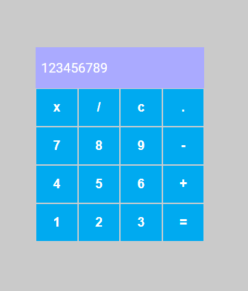

<hr>

# React - Formação React

Bem-vindo ao "Projetos Desafio Calculadora - React"! 🚀 Este é um repositório dedicado ao projeto React para Iniciantes, ministrado por @pablohdev.

## Descrição

Projetos Desafio Calculadora - React é uma aplicação web que oferece uma variedade de recursos e conteúdos relacionados a diversos projetos básicos e intermediários. Este repositório contém o código-fonte e os arquivos essenciais para executar a aplicação em sua máquina local.

## Funcionalidades Principais

- 🌐 Instruções dos Projetos
- 📚 Recursos Interativos
- 💻 Ambiente de Desenvolvimento Integrado (IDE)

## Instruções de Instalação

Siga estas etapas para configurar o Projeto Desafio Calculadora em sua máquina:

1. **Clone o Repositório:**

   ```bash
   git clone git@github.com:ITDallAgnol/DIO_Formacao_React.git
   ```

2. **Acesse a pasta:**

   ```bash
   cd ...04_React/Desafio01_calculadora/desafio01_calculadora
   ```

3. **Instale as dependências:**

   ```bash
   npm install
   ```
   
4. **Rode o projeto:**
    > Windows | Linux

   ```bash
   npm start ou "npm run dev"
   ```


### Contribuição

Contribuições são bem-vindas! Se você deseja melhorar o projeto, siga estas diretrizes:

1. Faça um Fork do projeto
2. Crie uma nova branch `git checkout -b feature/nova-feature`
3. Faça commit das suas alterações `git commit -am 'Adiciona nova feature'`
4. Faça push para a branch `git push origin feature/nova-feature`
5. Abra um Pull Request

### Contato

Se precisar de ajuda ou tiver alguma dúvida, sinta-se à vontade para entrar em contato:

Desenvolvedor: @devbdallagnol